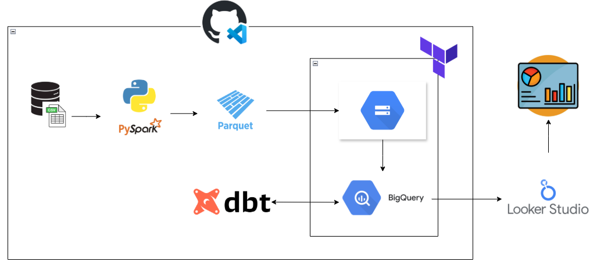
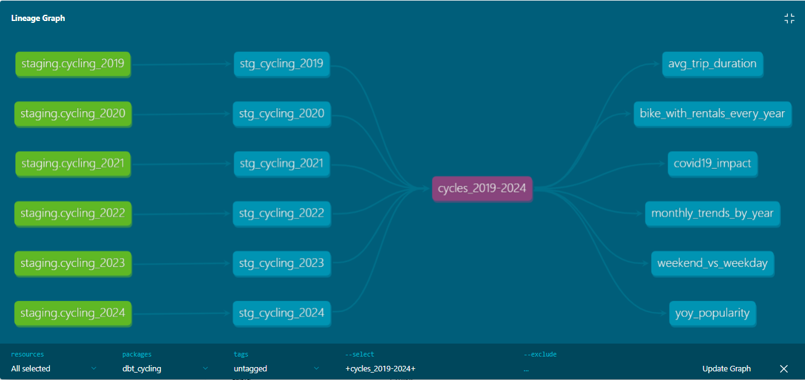

# Cycling Trips Data Pipeline (Data Engineering)
**A Comprehensive Report on Building an End-to-End Data Pipeline**  

## Table of Contents
- [Objective](#objective)
- [About Dataset](#about-dataset)
- [Overview](#1-overview)
- [Architecture Diagram](#2-architecture-diagram)
- [Technologies Used](#3-technologies-used)
- [Preparing the Environment with Github Codespaces](#4-preparing-the-environment-with-github-codespaces)
- [Step-by-Step Implementation](#5-step-by-step-implementation)
- [ELT Pipeline in Bash Script](#6-elt-pipeline-in-bash-script)


## Objective
Efficiently move, transform, and manage data from various sources to destinations using Google Cloud Platform where it can be analyzed and utilized.

## About Dataset 
+ This dataset was obtained from [London Datastore/Cycling Infrastructure Database](
https://cycling.data.tfl.gov.uk/)

+ For this project data from year 2019-2024 was used.

### Description
+ London’s Cycling Infrastructure Database (CID) is the world’s largest and most comprehensive database of cycling infrastructure, containing comprehensive details of cycling infrastructure in the Capital. The CID is intended to address barriers to cycling by providing Londoners with clear and accurate information about cycling infrastructure, helping them plan cycle journeys with confidence. The CID is a core part of our Cycling Action Plan , which sets out how TfL, boroughs and others will work together to make London the world’s best big city for cycling.


## 1. Overview  
This project demonstrates a **modern data engineering pipeline** using:  
- **Terraform** (Infrastructure as Code)  
- **Python** (Data Ingestion)
- **PySpark** (Data Processing)  
- **Google Cloud Storage (GCS)** (Data Lake)  
- **BigQuery** (Data Warehouse)  
- **dbt (Data Build Tool)** (Transformation & Modeling)  
- **Looker Studio** (Visualization & BI)  

## 2. Architecture Diagram  




## 3. Technologies Used
|Tools  | Purpose |
|-------|---------|
| **Terraform**	| Automates GCP resource provisioning (BigQuery, GCS, IAM) |
**Python**	| Extracts and Downloads data from UK cycling database
**PySpark** | Transforms and moves data to GCS
**Google Cloud Storage (GCS)**	| Stores raw and processed data (data lake)
**BigQuery** | Data warehouse for structured analytics
**dbt (Data Build Tool)**	| Transforms raw data into analytics-ready models
**Looker Studio**	| Creates interactive dashboards

## 4. Preparing the Environment with Github Codespaces
### 4.1 **Installing Terraform**
- installing from this [website](https://developer.hashicorp.com/terraform/downloads)
```bash
wget -O - https://apt.releases.hashicorp.com/gpg | sudo gpg --dearmor -o /usr/share/keyrings/hashicorp-archive-keyring.gpg
echo "deb [arch=$(dpkg --print-architecture) signed-by=/usr/share/keyrings/hashicorp-archive-keyring.gpg] https://apt.releases.hashicorp.com $(lsb_release -cs) main" | sudo tee /etc/apt/sources.list.d/hashicorp.list
sudo apt update && sudo apt install terraform
```
### 4.2 **Install jupyter notebook**
```bash
pip install jupyter notebook
```
### 4.3 **Setting up service account in Google Cloud**
- go to google cloud > IAM & Admin > Service Accounts > Create service account > create new key

### 4.4 **Using Codespace Secret**
- go to repository that has codespace > settings > secrets and variables > codespaces

### 4.5 **Download [SDK](https://cloud.google.com/sdk/docs/install-sdk) for local setup**

### 4.6 **Create the File in Codespace. Run these commands in the terminal**:
```bash
Copy
# Create the .config/gcloud directory (if it doesn't exist)
mkdir -p ~/.config/gcloud

# Write the secret to key.json
echo "$GOOGLE_CREDENTIALS_JSON" > ~/.config/gcloud/key.json

# Set strict permissions (required for security)
chmod 600 ~/.config/gcloud/key.json
```
**Verify the Key**

```bash
Copy
# Check if the file exists and has content
cat ~/.config/gcloud/key.json

# Validate JSON format (install jq if needed: sudo apt-get install jq)
jq '.' ~/.config/gcloud/key.json
```
**Authenticate with Google Cloud**

```bash
Copy
# Activate the service account
gcloud auth activate-service-account --key-file=/home/codespace/.config/gcloud/key.json

# Verify authentication
gcloud config list
```
**Check if the secret was loaded:**

```bash
Copy
echo "Length of secret: ${#GOOGLE_CREDENTIALS_JSON}"
```
If 0, restart the Codespace or re-add the secret.

### 4.7 **Installing PySpark**

+ Instructions [here](https://github.com/DataTalksClub/data-engineering-zoomcamp/blob/main/05-batch/setup/linux.md)

+ Download : wget https://dlcdn.apache.org/spark/spark-3.5.5/spark-3.5.5-bin-hadoop3.tgz
```bash
export JAVA_HOME="${HOME}/.config/spark/jdk-11.0.2"
export PATH="${JAVA_HOME}/bin:${PATH}"

export SPARK_HOME="${HOME}/.config/spark/spark-3.5.5-bin-hadoop3"
export PATH="${SPARK_HOME}/bin:${PATH}"
```

+ paste this before running jupyter:

```bash 
export PYTHONPATH="${SPARK_HOME}/python/:$PYTHONPATH"
export PYTHONPATH="${SPARK_HOME}/python/lib/py4j-0.10.9.7-src.zip:$PYTHONPATH"
```

### 4.8 **Installing Hadoop (GCS connector)**
gsutil cp gs://hadoop-lib/gcs/gcs-connector-hadoop3-2.2.5.jar gcs-connector-hadoop3-2.2.5.jar

## 5. Step-by-Step Implementation 
### 5.1 Terraform Setup (Infrastructure as Code)
`./Terraform/variables.tf`
`./Terraform/main.tf`

**Run Terraform:**

```bash
terraform init
terraform plan
terraform apply
```

### 5.2 Python and PySpark (Download data from database)
+ Fetches data and convert to parquet:
```bash 
python3 ./python_scripts/01_download-convert.py \
  --prefix-start $PREFIX_START \
  --prefix-end $PREFIX_END \
  --date-start $DATE_START \
  --date-end $DATE_END \
  --year $YEAR
``` 
### 5.3 Copy processed Parquet files to GCS and combine
```bash
gsutil -m cp -r "$LOCAL_PROCESSED_PATH"/* "$GCS_UPLOAD_PATH"

python3 ./python_scripts/02_combine-to-gcs.py
```

### 5.4 GCS to Bigquery
```bash 
bq query --use_legacy_sql=false < cycling_query.sql \
--project_id=boreal-quarter-455022-q5
``` 

### 5.5 dbt (Data Transformation & Modeling)

`~/.dbt/profiles.yml` (dbt config):

```yaml
dbt_cycling:
  outputs:
    dev:
      dataset: cycling_outputs
      job_execution_timeout_seconds: 300
      job_retries: 1
      keyfile: /home/codespace/.config/gcloud/key.json
      location: asia-southeast1
      method: service-account
      priority: interactive
      project: boreal-quarter-455022-q5
      threads: 4
  target: dev
```

`./dbt_cycling/models/core/cycles_2019-2024.sql` 

```bash
dbt run  # Builds models in BigQuery
dbt docs generate  # Generates data lineage
```
**DBT graph**



### 4.6 Looker Studio (Visualization)


## 6. ELT Pipeline in Bash Script

`./pipeline.sh`
